# Detailed Analysis of a Lua Neural Network for Word-to-Character Sequence Prediction

**Your Name**

**Date:** Today's Date

## Abstract

This paper provides an in-depth analysis of a Lua-based neural network designed for predicting character sequences from word sequences. We explore the network's architecture, implementation details, and the underlying mathematical principles. We also discuss potential applications and propose several enhancements to improve its performance and robustness.

## Introduction

The Lua script under examination implements a feedforward neural network that learns to map sequences of three words to sequences of three characters. This is achieved through a supervised learning approach, utilizing a dataset in CSV format. The script further includes functionalities for model persistence, enabling the saving and loading of trained models.

## Methodology

### Data Acquisition and Preprocessing

The `load_data()` function reads a CSV file, "dataset.csv," where each line is structured as: `word1, word2, word3, character_sequence`. The function populates the `training_data` table and constructs word and character vocabularies. These vocabularies are then mapped to numerical indices using the `word_to_ix`, `char_to_ix`, and `ix_to_char` dictionaries.

### Neural Network Architecture

The network comprises three layers: an input layer, a hidden layer, and an output layer.

* **Input Layer:** The size is determined by `3 * |Vw|`, where `|Vw|` is the size of the word vocabulary. Each input word is encoded as a one-hot vector.
* **Hidden Layer:** The size is a configurable parameter, `HIDDEN_SIZE`. The sigmoid activation function is applied.
* **Output Layer:** The size is determined by `3 * |Vc|`, where `|Vc|` is the size of the character vocabulary. The softmax function is applied to character groups.



### Mathematical Foundations

#### Activation Functions

The sigmoid function, σ(x), and the softmax function, S(t)i, are defined as:
```
σ(x) = 1 / (1 + e^(-x))
S(t)i = e^(t_i) / Σ_j e^(t_j)
```

#### Forward Propagation

The forward propagation is performed as follows:

1.  Compute the hidden layer activations: `h_j = σ(Σ_i w_ij^(1) x_i + b_j^(1))`.
2.  Compute the output layer activations: `o_k = Σ_j w_jk^(2) h_j + b_k^(2)`.
3.  Apply softmax to character groups: `y_k = S(o_k)`.

#### Backpropagation

The network is trained using backpropagation with gradient clipping. The error is calculated using the mean squared error (MSE) loss function. The weight updates are performed according to the gradients of the loss with respect to the weights.

### Model Persistence

The `save_model()` and `load_model()` functions facilitate saving and loading the trained model to/from a Lua file, "model.lua."

## Implementation Details

### Data Conversion

The `input_to_vector()` and `output_to_vector()` functions convert input words and output characters into one-hot encoded vectors.

### Training Procedure

The `train()` function initializes the weights, performs forward and backward passes, and updates the weights using gradient descent. Gradient clipping is applied to prevent exploding gradients.

### Prediction

The `predict()` function takes a sequence of three words, converts it to a vector, performs forward propagation, and outputs the predicted character sequence.

## Applications

This network can be applied in various domains, including:

* Text processing and natural language understanding.
* Data transformation and mapping.
* Educational demonstrations of neural network concepts.

## Proposed Enhancements

* **Recurrent Neural Networks (RNNs):** Employing RNNs or LSTMs to capture sequential dependencies more effectively.
* **Embeddings:** Using word embeddings like Word2Vec or GloVe to capture semantic relationships.
* **Hyperparameter Tuning:** Optimizing learning rate, hidden layer size, and other parameters.
* **Regularization:** Implementing L1 or L2 regularization to prevent overfitting.
* **Batch Normalization:** Applying batch normalization to stabilize training.
* **Larger Datasets:** Training on larger and more diverse datasets.

## Conclusion

This paper has detailed the implementation and functionality of a Lua-based neural network for word-to-character sequence prediction. By understanding its architecture and proposing enhancements, it can serve as a foundation for more advanced applications in natural language processing.
